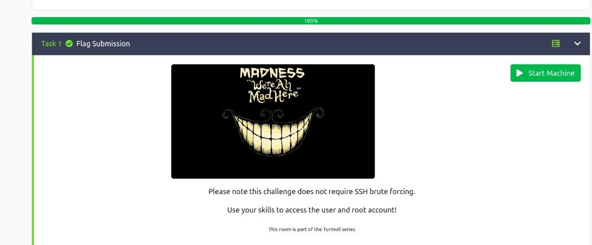

# madness-write-up

this is a write up for the tryhackme machine "madness"

first of all deploy the machine and make sure you are connected to the vpn

the first step is to enumerate to find as much information about our target as possible
i'll use this command "nmap -p- -A -sC -vv -oN full_ports <ip>"
	
	-p- -> the option is used to scan all ports, the default is to scan only the top 1000 ports but this flag will scan all 65535 ports
	-A  -> flag enables os detection, version detection and script scanning
	-sC -> to scan with default NSE scripts. Considered useful for discovery and safe
	-vv -> to increase the verbosity level
	-oN -> save the output to a text file in our case it's called "full_ports"
	ip  -> and finally specify the machine's ip

i always love to start gobuster and nikto however they are not necessary in this room

looking at the web page we find the default page for apache2 and it's always important to take a look in the page source code  

we'll find a comment saying "they will never find me" and it's pointing to an image that is not visible in the default page so we will download that picture by copying it's location and using wget
the command ~> wget "<the-link-you-copied>"

but you'll notice that you can't open the image, let's use the "file" command and figure what's wrong "file thm.jpg" it says it's a png file but the extension is jpg so we need to edit the file to match the signature(magic number) for the jpg, after one google search i found this link "https://en.wikipedia.org/wiki/List_of_file_signatures" 

so the jpg magic number is "FF D8 FF E0 00 10 4A 46 49 46 00 01" we just need to add this into the picture information and we can do this using hexedit -> "hexeditor thm.jpg" and put the magic number at the begining of the first line 

if we use file command again it proves that our edit is succesful and we can open the picture now
which contains a name of a hidden directory "/th1s_1s_h1dden" if we head to that directory we'll see it's asking for a secret number. and do you remember when i told you it's important to view the source code? let's do it again... "a number between 1 and 99"

so we need to pass it a secret number from 1 to 99 and the parameter is obviously called "secret" let's try 1 "http://<ip>/th1s_1s_h1dd3n/?secret=1" the page recognizes the number but sadly it's the wrong number 
it won't be that easy you feel me?

i made a very simple and straight forward bash script to loop over the numbers so i can do this faster :

1. nano script.sh
	and write this code inside it 
		for (( i=0 ;100 > i ; i++ )); do
		curl <ip>/th1s_1s_h1dd3n/?secret=$i
		done
2. chmod +x script.sh ~~~~> to make it executable

and now run it using ./script.sh it will take a few seconds until you find that one number gave a different output let's head to firefox so we can take a closer look
http://<ip>/th1s_1s_h1dd3n/?secret=<the number you found>

now this is where i spent alot of time trying decrypt what i thought is a cipher of the username and then i thought what if it was steganography and the image extension is jpg so it might be :)
next thing is "steghide extract -sf thm.jpg -p <the password you found>"
and walaa "wrote extracted data to hidden.txt" that's a good news

the hidden.txt file has the username but in an indirect way so we need to decrypt it, after a couple of tries (rot13) was the one the revealed the username 

i tried to login to ssh using the username and the password (that we found on the web page) but it didn't work then we need the password because we know the username is 100% correct

after alot of tries i thought of downloading the image that's in tryhackme website and try some stego on it

wget "https://i.imgur.com/5iW7kC8.jpg" ~> and it's one more time a jpg so it's a high chance it is a stego 
steghide extract -sf 5iW7kC8.jpg and enter a null password then you'll have a password.txt file there you can find the password for the user 

after logging into the machine now we need to escalate our privilges to root

i ran "sudo -l" to check what commands can i run but nothing
then i went to searching for SUID and found an intersting one "GNU Screen 4.5.0" after googling it i came to this site "https://www.exploit-db.com/exploits/41154" which has a code that will exploit the SUID to get root

i copied the code and made a file called exploit.sh and paste the code in it we need to make it executable using "chmod +x exploit.sh" now running it will get us root ^^

you can get a proper shell using this command "/usr/bin/script -qc /bin/bash /dev/null" 
and now you can go and claim all the flags

written by yanal abuseini
